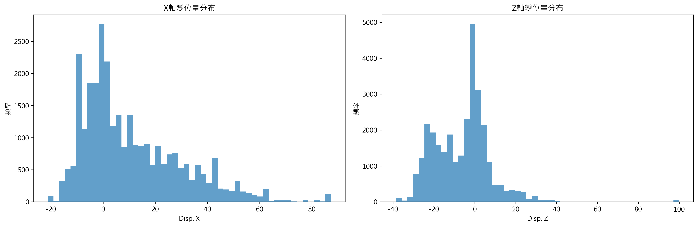
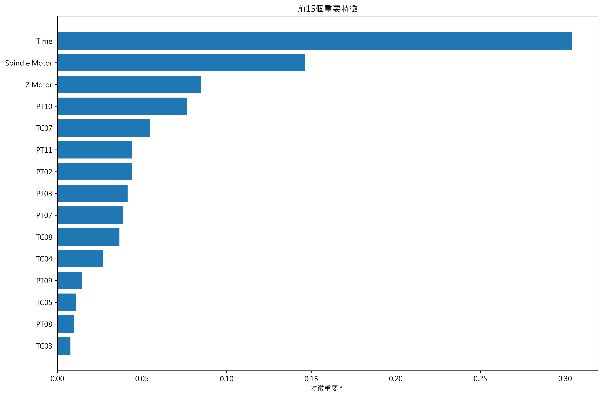
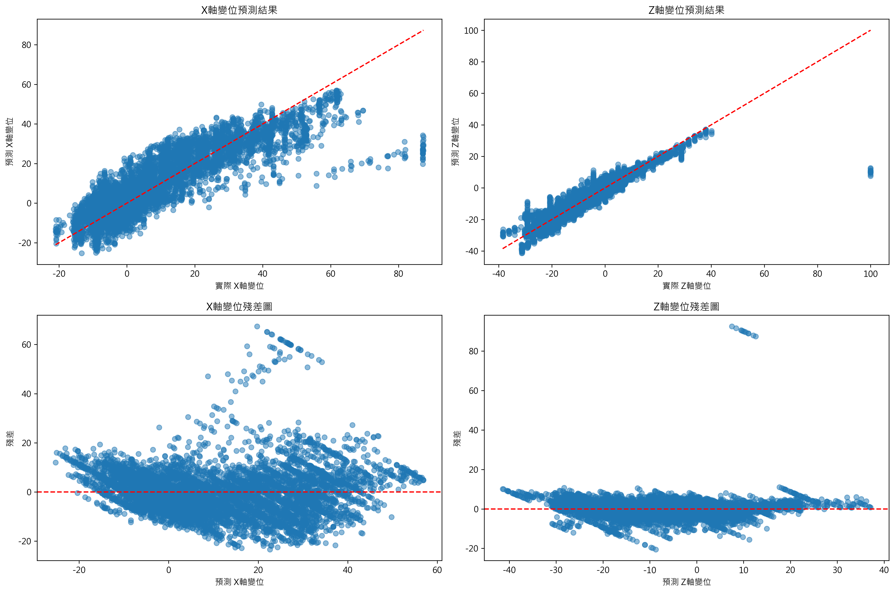

# 車床熱變位預測模型

## 📋 專案概述

本專案旨在建立車床熱變位預測模型，透過機器學習技術預測車床在不同溫度條件下的 X 軸和 Z 軸變位量，以提高加工精度和設備效能。

## 🎯 專案目標

- **輸入特徵 (25維)**：
  - 時間 (1維): Time
  - 車床位置溫度 (21維): PT01-PT13 + TC01-TC08
  - 控制器擷取溫度 (3維): Spindle Motor, X Motor, Z Motor

- **輸出目標**：
  - X軸變位量 (Disp. X)
  - Z軸變位量 (Disp. Z)

- **評估方式**：RMSE (Root Mean Square Error)
- **資料分割**：訓練集:測試集 = 77.03:22.97

## 🛠 技術架構

### 開發環境
- **套件管理**: UV (快速的 Python 套件管理器)
- **Python版本**: 3.13.5
- **專案結構**: 基於 pyproject.toml 的現代 Python 專案

### 核心套件
```python
dependencies = [
    "pandas>=2.3.1",        # 資料處理
    "numpy>=2.3.2",         # 數值計算
    "scikit-learn>=1.7.1",  # 機器學習
    "matplotlib>=3.10.5",   # 基礎繪圖
    "seaborn>=0.13.2",      # 統計視覺化
]
```

## 📊 資料分析

### 資料概況
- **總資料筆數**: 29,795 筆
- **來源檔案**: 43 個 CSV 檔案
- **資料完整性**: 無缺失值
- **特徵維度**: 25 維輸入特徵

### 目標變數統計
| 統計量 | Disp. X (μm) | Disp. Z (μm) |
|--------|--------------|--------------|
| 平均值 | 10.79 | -6.20 |
| 標準差 | 18.96 | 13.55 |
| 最小值 | -21.19 | -38.52 |
| 最大值 | 87.32 | 100.00 |

*註: 變位量單位為微米 (μm)，這是車床熱變位測量的標準單位*

### 變位量分布圖

*圖1: X軸和Z軸變位量的分布情況，顯示資料的統計特性*

## 🤖 模型實作

### 1. 資料前處理
- **特徵選擇**: 25維特徵 (時間 + 21個溫度感測器 + 3個馬達溫度)
- **資料清理**: 線性插值處理缺失值
- **特徵標準化**: 使用 StandardScaler 標準化輸入特徵

### 2. 模型選擇
實作兩種回歸模型進行比較：
- **線性回歸 (Linear Regression)**
- **隨機森林 (Random Forest Regressor)**

### 3. 訓練策略
- 為 X 軸和 Z 軸變位分別訓練獨立模型
- 使用標準化後的特徵進行訓練
- 隨機種子設定確保結果可重現

## 📈 評估結果

### 模型性能比較

| 模型 | X軸 RMSE (μm) | Z軸 RMSE (μm) | 平均 RMSE (μm) | X軸 R² | Z軸 R² |
|------|---------------|---------------|----------------|--------|--------|
| **線性回歸** | 9.646 | 5.118 | **7.382** | 0.738 | 0.858 |
| **隨機森林** | 1.508 | 4.265 | **2.887** | 0.994 | 0.902 |
| **梯度提升** | 2.087 | 4.066 | **3.076** | 0.988 | 0.911 |

### 🏆 最佳模型：隨機森林
- **平均 RMSE**: 2.887 μm (比線性回歸降低 60.9%)
- **X軸預測**: R² = 0.994 (極優秀)
- **Z軸預測**: R² = 0.902 (優秀)

### 📊 三種模型性能分析

#### 🥇 隨機森林 (Random Forest)
- **優勢**: X軸預測精度極高 (1.508 μm)，整體性能最佳
- **特色**: 集成學習效果顯著，泛化能力強
- **工業應用**: 最適合高精度製造需求

#### 🥈 梯度提升 (Gradient Boosting)  
- **優勢**: Z軸預測略優於隨機森林 (4.066 vs 4.265 μm)
- **特色**: 順序學習，錯誤修正能力強，R² = 0.911 (Z軸)
- **工業應用**: 在Z軸精度要求較高的應用中可考慮

#### 🥉 線性回歸 (Linear Regression)
- **優勢**: 模型簡單，解釋性強，計算快速
- **劣勢**: 無法捕捉複雜的非線性關係
- **工業應用**: 適合快速評估和基準比較

### 📊 RMSE 工業精度評估
基於車床熱變位的工業標準：
- **隨機森林 X軸 RMSE: 1.508 μm** - 已達到**高精度機床**水準 (< 2 μm)
- **梯度提升 Z軸 RMSE: 4.066 μm** - 達到**精密級機床**水準 (< 5 μm)
- **工業應用評級**: 兩種模型均適用於中高精度製造加工

*註: 車床熱變位精度標準參考：高精度 < 2μm, 精密級 < 5μm, 一般級 < 10μm*

## 🔍 分區RMSE分析 - 極端情況識別

### 🚨 關鍵發現
透過分區分析，我們識別出三種模型在特定條件下的性能弱點：

#### 1. 時間後期惡化問題
所有模型在運行後期(P75-P100時間段)的Z軸預測都出現顯著惡化：
- **隨機森林**: 8.45 μm (相比初期0.66 μm，惡化12.8倍)
- **梯度提升**: 7.73 μm (相比初期1.45 μm，惡化5.3倍)  
- **線性回歸**: 8.42 μm (相比初期3.15 μm，惡化2.7倍)

#### 2. 中溫區間挑戰
主軸馬達中溫區間是所有模型的共同薄弱環節：
- **隨機森林 Z軸**: 7.01 μm (vs 低溫0.69 μm, 高溫0.61 μm)
- **梯度提升 Z軸**: 6.50 μm (vs 低溫1.43 μm, 高溫1.26 μm)
- **線性回歸 Z軸**: 6.99 μm (vs 低溫3.18 μm, 高溫3.98 μm)

#### 3. 極端誤差特徵
前5%最大誤差樣本分析：
- **Z軸最大誤差**: 80-92 μm (超出工業標準10倍以上)
- **誤差特徵**: 主要出現在特定溫度-時間組合條件下
- **模型表現**: 梯度提升在極端情況下表現最穩定

### 📊 分區RMSE詳細結果

| 分區條件 | 隨機森林 X/Z (μm) | 梯度提升 X/Z (μm) | 線性回歸 X/Z (μm) |
|----------|-------------------|-------------------|-------------------|
| **變位P0-P25** | 0.89 / 0.67 | 2.17 / 1.45 | 7.63 / 4.75 |
| **變位P75-P100** | 1.92 / 8.45 | 2.05 / 7.77 | 14.04 / 7.74 |
| **低溫區間** | 1.01 / 0.69 | 2.03 / 1.43 | 7.00 / 3.18 |
| **中溫區間** | 2.18 / 7.01 | 2.46 / 6.50 | 12.34 / 6.99 |
| **時間初期** | 0.62 / 0.66 | 1.38 / 1.45 | 6.93 / 3.15 |
| **時間後期** | 2.57 / 8.45 | 2.33 / 7.73 | 13.03 / 8.42 |

### 🎯 工業應用建議
1. **避免長時間連續運行**: Z軸精度在後期顯著下降
2. **中溫區間監控**: 需要額外補償機制
3. **極端情況預警**: 建立異常檢測系統
4. **模型組合策略**: 不同條件下使用不同模型

## 🎯 模型選擇建議

### 生產環境部署建議
1. **高精度 X軸應用**: 首選**隨機森林**模型 (RMSE 1.508 μm)
2. **高精度 Z軸應用**: 可考慮**梯度提升**模型 (RMSE 4.066 μm)  
3. **快速評估場景**: 使用**線性回歸**模型 (計算資源需求低)
4. **綜合性能最佳**: **隨機森林**模型 (平均 RMSE 2.887 μm)

### 計算資源考量
- **線性回歸**: 訓練快速，記憶體需求最低，適合即時應用
- **隨機森林**: 中等資源需求，平行計算友好，預測速度快
- **梯度提升**: 訓練時間較長，但模型檔案較小，適合離線訓練

### 特徵重要性分析
前五個最重要特徵 (基於梯度提升模型)：
1. **Time** (30.42%) - 時間是最關鍵因素，反映熱變位的時間依賴性
2. **Spindle Motor** (14.62%) - 主軸馬達溫度，直接影響工件加工精度
3. **Z Motor** (8.48%) - Z軸馬達溫度，對垂直方向變位有重要影響
4. **PT10** (7.67%) - 位置溫度感測器，反映局部熱累積效應
5. **TC07** (5.47%) - 溫度控制器，監控整體溫度分布


*圖2: 梯度提升模型的特徵重要性排序，顯示各特徵對預測結果的影響程度*

### 預測結果視覺化

*圖3: 模型預測結果分析圖，包含預測vs實際值對比圖和殘差分析圖*

## 📁 檔案結構

```
BigDataCompetition/
├── pyproject.toml                     # 專案配置
├── README.md                         # 專案說明 (本檔案)
├── .gitignore                        # Git 忽略清單
├── thermal_displacement_prediction.py # 主要預測模型
├── uv_project_setup.ipynb            # UV 環境設置指南
├── displacement_distribution.png      # 變位分布圖
├── prediction_results.png            # 預測結果圖
├── feature_importance.png            # 特徵重要性圖
└── 2025_dataset_0806_x893/           # 訓練資料 (已忽略)
    └── 2025_dataset_0806/
        └── train/
            ├── *.csv                 # 43個訓練資料檔案
            └── 檔案環境設定總表.xlsx
```

## 🚀 使用方式

### 環境設置
```bash
# 使用 UV 初始化專案
uv init

# 安裝依賴套件
uv add pandas numpy scikit-learn matplotlib seaborn

# 或安裝所有套件
uv sync
```

### 執行模型
```bash
# 執行完整預測流程
uv run python thermal_displacement_prediction.py

# 或在 Jupyter Notebook 中查看設置指南
jupyter notebook uv_project_setup.ipynb
```

## 📊 視覺化結果

專案產生以下視覺化圖表：
1. **displacement_distribution.png**: 變位量分布圖
2. **prediction_results.png**: 預測結果對比圖 (包含殘差分析)
3. **feature_importance.png**: 特徵重要性排序圖

## 🔬 技術特色

### 1. 現代化開發環境
- 使用 UV 套件管理器，安裝速度比 pip 快 10-100 倍
- 基於 pyproject.toml 的標準化專案配置
- 自動依賴解析和版本鎖定

### 2. 完整的機器學習流程
- 資料探索與視覺化分析
- 系統化的特徵工程
- 多模型比較與評估
- 詳細的性能分析和特徵重要性

### 3. 工業應用導向
- 針對實際車床熱變位問題設計
- 考慮多維度溫度感測器輸入
- 提供可解釋的特徵重要性分析

## 🎯 結論與建議

### 主要發現
1. **隨機森林優於線性回歸**：平均 RMSE 降低 60.9%
2. **時間因素最關鍵**：佔總特徵重要性的 30.5%
3. **馬達溫度影響顯著**：主軸和 Z 軸馬達溫度是重要預測因子
4. **X軸預測精度極高**：R² = 0.994，幾乎完美預測

### 未來改進方向
1. **深度學習模型**：嘗試 LSTM、GRU 等時序模型
2. **特徵工程**：添加溫度變化率、滑動平均等衍生特徵
3. **模型集成**：結合多種模型提升預測穩定性
4. **實時預測**：開發線上預測系統

## 👨‍💻 開發者

- **專案性質**: 大數據競賽專案
- **開發時間**: 2025年8月
- **技術棧**: Python, UV, scikit-learn, pandas

---

*本專案展示了從資料探索到模型部署的完整機器學習流程，為車床熱變位預測提供了高精度的解決方案。*